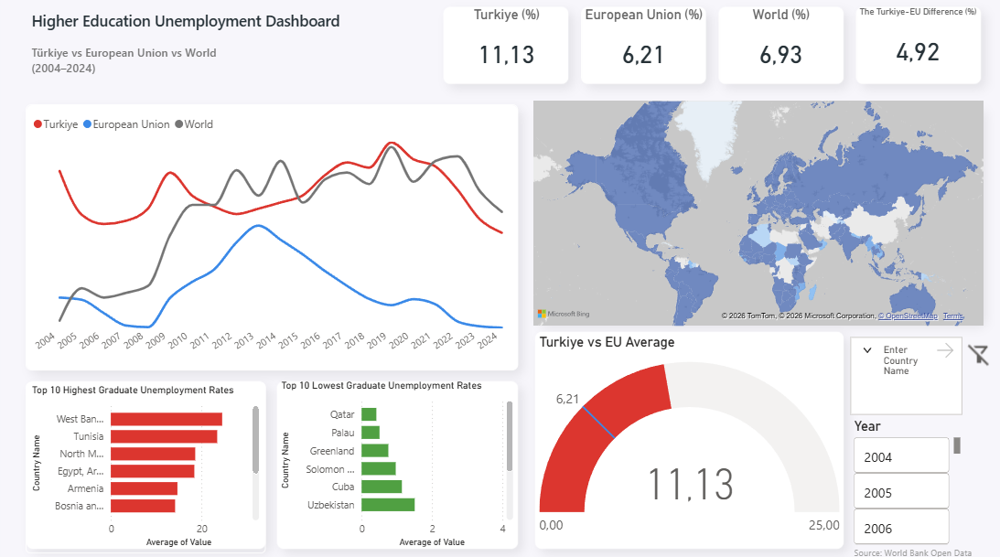

# 📊 Higher Education Unemployment Dashboard

An interactive Power BI dashboard analyzing higher education unemployment rates across countries using World Bank data.

## 📌 Project Overview

This dashboard compares graduate unemployment rates between **Türkiye**, the **European Union**, and the **World** from **2004 to 2024**.

The project aims to identify trends, compare regional performance, and highlight countries with the highest and lowest unemployment rates among individuals with higher education.

---

## 🚀 Dashboard Features

- KPI Cards
  - Türkiye Unemployment Rate
  - European Union Average
  - World Average
  - Türkiye–EU Difference

- Trend Analysis (2004–2024)

- Filled Map Visualization

- Top 10 Highest Graduate Unemployment Rates

- Top 10 Lowest Graduate Unemployment Rates

- Gauge Chart (Türkiye vs EU Average)

- Interactive Filters
  - Year
  - Country
  - Reset Filters Button

---

## 🛠 Tools Used

- Power BI
- Power Query
- DAX
- World Bank Open Data

---

## 📂 Dataset

Source:
https://data.worldbank.org/

Indicator:
**Unemployment with advanced education (% of total labor force with advanced education)**

---

## 📷 Dashboard Preview

---

## 📈 Key Insights

- Türkiye's graduate unemployment rate remains above the European Union average.
- Users can explore unemployment trends between 2004 and 2024.
- The dashboard highlights countries with the highest and lowest graduate unemployment rates.
- Interactive filters allow dynamic exploration of the data.

---

## 👤 Author

Mehmet Ateş

GitHub:
https://github.com/mehmetatesbi
